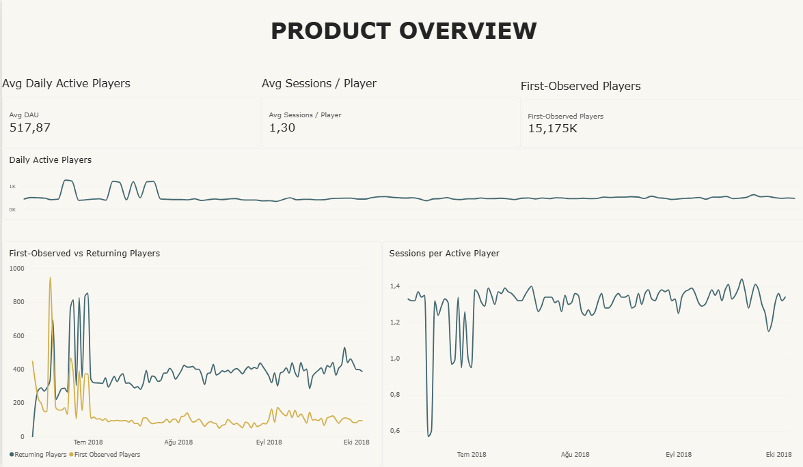
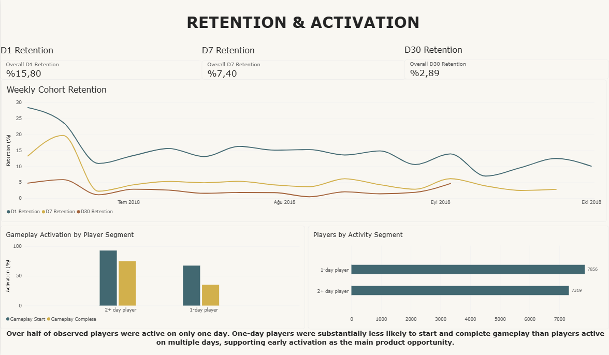
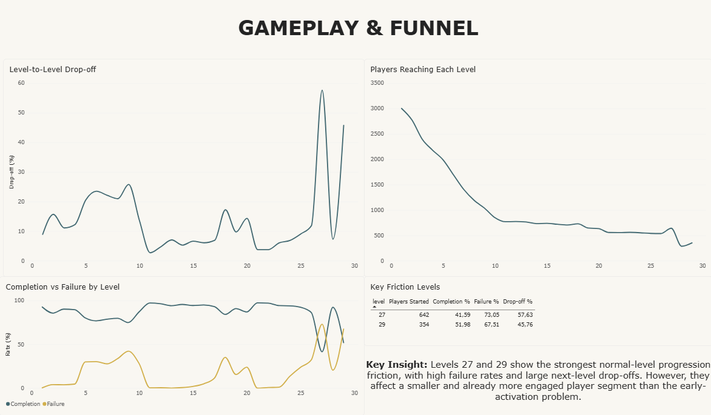
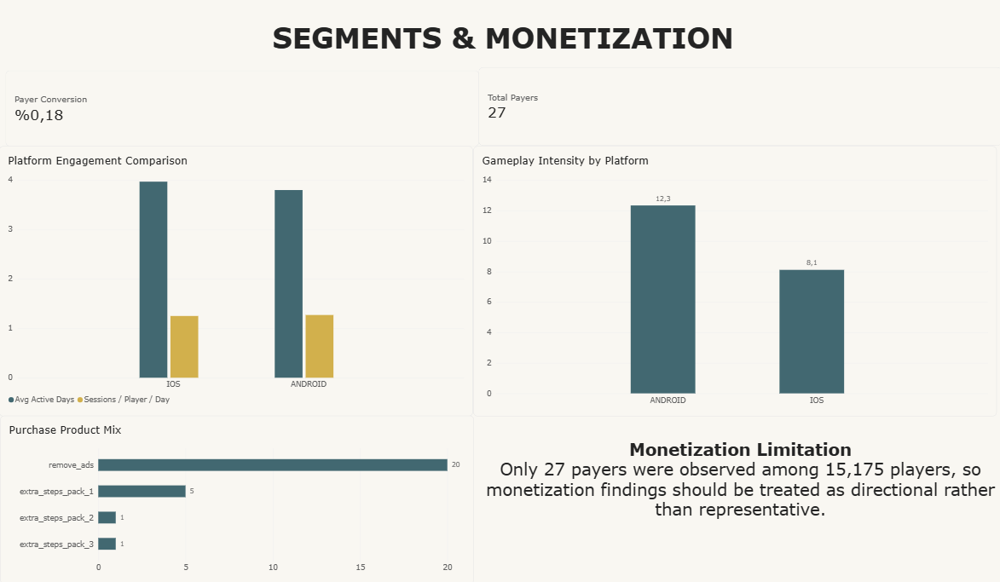

# Mobile Game Product & User Behavior Analytics

**End-to-end product analytics project using SQL, BigQuery, Python, A/B testing and Power BI.**

This project analyzes **5.7 million mobile game events** from approximately **15.2K pseudonymous players** to understand player activity, engagement, gameplay progression, retention and monetization.

The analysis identified **early-player activation and retention** as the primary product opportunity. Based on the findings, I proposed a guided first-session experience and designed a **simulated A/B test** to evaluate its potential impact.

> **Dataset:** Google Flood It! Firebase / Google Analytics public BigQuery dataset  
> `firebase-public-project.analytics_153293282.events_*`

---

## Project at a Glance

| Area | Result |
|---|---:|
| Events analyzed | **5.7M** |
| Pseudonymous players | **15,175** |
| Avg. Daily Active Players | **517.87** |
| D1 Retention | **15.80%** |
| D7 Retention | **7.40%** |
| D30 Retention | **2.89%** |
| Players active only 1 day | **51.77%** |
| Players active ≤3 days | **78.10%** |
| Level 27 next-level drop-off | **57.63%** |
| Level 29 next-level drop-off | **45.76%** |
| Payers | **27** |
| Payer conversion | **0.178%** |

---

# Business Objective

The goal was to understand:

- How active are players?
- Do players return after their first observed activity?
- How strongly do players engage with core gameplay?
- Where does gameplay progression break down?
- Are there meaningful differences across player segments?
- What monetization behavior is observable?
- Which product problem should be prioritized?
- How could a product improvement be validated through an experiment?

The project was designed to go beyond descriptive reporting and connect:

**data → player behavior → product opportunity → experiment → product decision**

---

# Dataset & Event Model

The dataset contains Firebase / Google Analytics mobile game event data covering approximately **114 days**.

### Raw event grain

> **1 row = 1 event**

Important fields include:

- `user_pseudo_id`
- `event_name`
- `event_timestamp`
- `event_date`
- `event_params`
- device information
- geography
- traffic source

Firebase event parameters are stored as nested arrays, so BigQuery `UNNEST()` was used to extract gameplay and purchase attributes.

Examples of analyzed events include:

- `session_start`
- `user_engagement`
- `screen_view`
- `level_start`
- `level_complete`
- `level_fail`
- `level_retry`
- `level_start_quickplay`
- `level_complete_quickplay`
- `in_app_purchase`

---

# Analytical Workflow

```text
Firebase / GA Raw Events
          ↓
Data Understanding
          ↓
Data Quality Checks
          ↓
cleaned_events_v
          ↓
player_daily_activity_v
          ↓
Product KPI / Funnel / Retention Analysis
          ↓
BI-ready BigQuery Views
          ↓
Power BI Dashboard
          ↓
Product Opportunity
          ↓
A/B Test Design
          ↓
Product Decision Framework
```

BigQuery was used for the main analytical logic and aggregations.

Power BI was used primarily as the **visualization and decision-support layer**, rather than importing the full 5.7M-event raw dataset directly.

---

# Data Quality & Validation

Before calculating product metrics, I checked:

- missing player identifiers
- missing event names
- timestamp coverage
- duplicate-like event combinations
- missing level parameters
- purchase parameter types
- purchase validation status
- differences between `event_date` and UTC-derived event dates

### Important findings

- No missing `user_pseudo_id`
- No missing event names
- Some normal-level events had missing level parameters
- Quickplay board parameters were complete for the main gameplay events
- Purchase data was extremely sparse
- Multiple currencies existed in purchase data
- `event_date` and UTC-derived calendar date differed for a substantial share of events

Because of this, a consistent date definition was used for activity and retention metrics.

---

# Data Modeling

Two reusable BigQuery views formed the analytical base.

### `cleaned_events_v`

Grain:

> **1 row = 1 event**

Contains cleaned event-level fields including player, date, platform, country, traffic source and selected gameplay parameters.

### `player_daily_activity_v`

Grain:

> **1 row = 1 player × 1 day**

Contains daily player activity such as:

- event count
- session starts
- level starts
- level completions
- failures
- engagement activity

Validation confirmed:

- **59,037 player-day rows**
- **15,175 unique players**
- **5.7M events reconstructed**
- no duplicate player × day grain

---

# Product KPI Analysis

## Player Activity

Average Daily Active Players:

**517.87**

Player activity was usually around a few hundred players per day, with several large spikes during late June.

However, higher DAU during these spikes did not always correspond to higher sessions per player.

This suggests that increased player volume did not necessarily translate into stronger engagement.

---

# Retention

Retention was calculated using exact return-day definitions.

| Metric | Result |
|---|---:|
| D1 Retention | **15.80%** |
| D7 Retention | **7.40%** |
| D30 Retention | **2.89%** |

Player active-day distribution also showed weak repeat activity:

- **51.77%** of players were active on only one day
- **78.10%** were active on three days or fewer
- Median observed active days = **1**

These results made retention one of the strongest product concerns in the dataset.

---

# Early Activation Analysis

A particularly strong difference appeared when comparing players active on only one day with players active on multiple days.

| Player Segment | Gameplay Start | Gameplay Complete |
|---|---:|---:|
| 1-day players | **67.58%** | **35.23%** |
| 2+ day players | **93.07%** | **75.12%** |

One-day players were substantially less likely to enter and complete core gameplay.

### Interpretation

Successful gameplay participation is strongly associated with repeat activity.

### Important caution

This is an **observational relationship**, not proof that gameplay completion causes retention.

More engaged players may naturally be more likely both to complete gameplay and to return.

---

# Gameplay & Funnel Analysis

Normal-level progression was evaluated using player-level metrics rather than relying only on raw event ratios.

For each level, I examined:

- players starting the level
- players completing the level
- players failing the level
- players reaching the next level

Two levels showed especially strong progression friction.

| Level | Players Started | Completion | Failure | Next-Level Drop-off |
|---|---:|---:|---:|---:|
| **27** | 642 | **41.59%** | **73.05%** | **57.63%** |
| **29** | 354 | **51.98%** | **67.51%** | **45.76%** |

These levels are strong candidates for gameplay difficulty or friction investigation.

However, they affect a much smaller and already more engaged player segment than the early activation problem.

> Level 30 was excluded from next-level drop-off visualization because Level 31 was outside the analyzed progression range.

---

# Product Opportunity

## Selected Problem

**Weak early-player activation and retention**

The strongest combined evidence was:

- low D1 / D7 / D30 retention
- over half of players active on only one day
- large activation gap between one-day and returning players

Late-level friction was considered important but secondary because fewer players reach those levels.

---

## Proposed Product Solution

### Guided First-Session Activation Flow

A lightweight first-session experience designed to help new players reach successful core gameplay earlier.

Possible components:

- clearer direction toward core gameplay
- contextual gameplay guidance
- one-time help after an early failure
- clearer progress feedback after first completion
- lightweight continue / replay CTA

The feature is a **product hypothesis**, not a proven solution.

---

# Product Requirements

### User Story

> As a new player, I want to understand the core gameplay quickly and complete my first meaningful game with minimal friction so that I feel progress and have a reason to return.

### Success Metrics

**Primary outcome**

- D1 retention

**Activation metric**

- First-session gameplay completion rate

**Secondary metrics**

- gameplay start rate
- D7 retention
- sessions per player
- time to first gameplay
- time to first gameplay completion

**Guardrails**

- crash / error rate
- session abandonment
- abnormal retry / failure increases
- monetization regression

More details are available in:

[`docs/product_case.md`](docs/product_case.md)

---

# A/B Test Design

> ⚠️ **SIMULATED / PROPOSED EXPERIMENT**  
> No real production A/B test was conducted.

The experiment was designed to test whether the guided activation flow could improve early retention.

### Experiment setup

**Control**

Existing first-session experience.

**Treatment**

Guided first-session activation flow.

**Randomization unit**

Player

**Split**

50% Control / 50% Treatment

**Primary metric**

D1 retention

**Historical baseline**

15.8%

**Candidate MDE**

+1.5 percentage points

**Planning assumptions**

- α = 0.05
- Power = 80%
- Two-sided test
- Approximately **9.6K users per group**

---

## Simulated Experiment Result

| Metric | Control | Treatment |
|---|---:|---:|
| D1 Retention | 15.80% | 17.50% |

Results:

- Absolute uplift: **+1.70 percentage points**
- Relative uplift: **+10.76%**
- p-value: **0.0013**
- 95% CI: **+0.67 pp to +2.73 pp**

### Decision

**ITERATE**

The simulated treatment produced a statistically significant positive result.

However, although the point estimate exceeded the predefined +1.5 percentage-point practical threshold, the confidence interval still included smaller effects.

Therefore, I would iterate on the treatment and validate further before recommending a full rollout.

### Experiment Files

- [Experiment design](experiment/ab_test_design.md)
- [Python analysis](experiment/ab_test_analysis.ipynb)

# Monetization

Only **27 payers** were observed among **15,175 players**.

Payer conversion:

**0.178%**

Purchase mix:

| Product | Purchases |
|---|---:|
| Remove Ads | **20** |
| Extra Steps Pack 1 | **5** |
| Extra Steps Pack 2 | **1** |
| Extra Steps Pack 3 | **1** |

Purchase currencies included USD, AUD, TWD, AED, DKK, JPY and CHF.

Because:

- the payer sample is extremely small
- multiple currencies are present
- purchase validation is incomplete for some events

monetization findings are treated as **directional rather than representative**.

No global revenue or LTV metric was reported without defensible currency normalization.

---

# Power BI Dashboard

The project includes a four-page Power BI dashboard.

### 1. Product Overview



Activity, player inflow and sessions-per-player trends.

---

### 2. Retention & Activation



Retention trends and the activation gap between one-day and returning players.

---

### 3. Gameplay & Funnel



Level progression, completion/failure behavior and key friction levels.

---

### 4. Segments & Monetization



Platform differences and directional purchase behavior.

The Power BI report file is available at:

[`powerbi/mobile_game_product_analytics.pbix`](powerbi/mobile_game_product_analytics.pbix)

---

# Dashboard Validation

Power BI metrics were cross-checked against BigQuery results.

Validated metrics included:

- Avg Daily Active Players
- sessions per player
- D1 / D7 / D30 retention
- activation segment metrics
- Level 27 / Level 29 funnel metrics
- payer conversion
- purchase product mix

One cohort-maturity issue was identified during dashboard preparation.

Players in the final partial observation periods who had not yet had enough time to become eligible for D1, D7 or D30 retention were excluded from the relevant denominators.

This validation step changed the final partial-week retention result and prevented immature cohorts from artificially lowering retention.

More details:

[`docs/validation.md`](docs/validation.md)

---

# Fact vs Interpretation

Throughout the analysis I separated:

**FACT → INTERPRETATION → HYPOTHESIS → RECOMMENDATION**

Example:

**Fact**

One-day players had much lower gameplay participation and completion.

**Interpretation**

Early gameplay activation is associated with repeat player activity.

**Hypothesis**

Helping players reach a successful gameplay experience earlier may improve retention.

**Recommendation**

Test a lightweight guided activation experience using a randomized experiment.

This distinction was used to avoid presenting observational relationships as causal findings.

---

# Key Limitations

- `user_pseudo_id` is a pseudonymous identifier and does not necessarily equal one real-world person.
- First-observed activity is not guaranteed to represent a true install.
- The dataset covers a limited historical window.
- Some normal-level events contain missing level parameters.
- Funnel results depend on event instrumentation quality.
- Gameplay progression and retention relationships are affected by selection bias.
- Level 27 / 29 friction does not prove that those levels cause churn.
- Purchase activity is extremely sparse.
- Multiple currencies prevent defensible direct aggregation without normalization.
- The A/B test result is explicitly **simulated**.
- No production deployment or real release was performed.

Full limitations:

[`docs/limitations.md`](docs/limitations.md)

---

# Tech Stack

### SQL / Analytics
- SQL
- Google BigQuery
- Firebase / GA event data
- Nested data and `UNNEST`
- CTEs
- joins
- conditional aggregation
- date logic
- window functions
- cohort analysis

### Product Analytics
- DAU / WAU / MAU
- stickiness
- engagement
- activation
- funnels
- D1 / D7 / D30 retention
- segmentation
- monetization
- product opportunity identification

### Experimentation
- hypothesis design
- control / treatment
- randomization
- sample-size planning
- minimum detectable effect
- two-proportion testing
- p-values
- confidence intervals
- statistical vs practical significance

### Visualization
- Power BI
- basic DAX
- BI-ready BigQuery views
- dashboard validation

### Statistics
- Python
- `statsmodels`

---

# Repository Structure

```text
mobile-game-product-analytics/
│
├── README.md
│
├── sql/
│   ├── 01a_data_understanding_overview.sql
│   ├── 01b_event_parameters_and_gameplay.sql
│   ├── 02_data_quality.sql
│   ├── 03a_cleaned_events_view.sql
│   ├── 03b_cleaned_events_validation.sql
│   ├── 03c_player_daily_activity_view.sql
│   ├── 03d_player_daily_activity_validation.sql
│   ├── 04a_product_kpis.sql
│   ├── 04b_player_activity_kpis.sql
│   ├── 05_engagement_analysis.sql
│   ├── 06_funnel_analysis.sql
│   ├── 07_retention_analysis.sql
│   ├── 08_monetization_analysis.sql
│   ├── 09_segmentation_analysis.sql
│   └── 10a-10f BI view queries
│
├── docs/
│   ├── product_case.md
│   ├── validation.md
│   └── limitations.md
│
├── experiment/
│   ├── ab_test_design.md
│   └── ab_test_analysis.ipynb
│
├── dashboard/
│   ├── README.md
│   ├── product_overview.png
│   ├── retention_activation.png
│   ├── gameplay_funnel.png
│   └── segments_monetization.png
│
└── powerbi/
    ├── README.md
    └── mobile_game_product_analytics.pbix
```

---

# Main Takeaway

The largest opportunity identified was **not simply a difficult late-game level**.

The broader problem was early-player activation and retention.

More than half of observed players were active for only one day, and those players were much less likely to engage successfully with core gameplay.

This led to a product recommendation focused on improving the first-session experience and validating the idea through experimentation rather than assuming causality from observational data.

---

## Skills Demonstrated

This project demonstrates the ability to:

- analyze millions of event-level records in BigQuery
- work with nested Firebase event data
- define and validate product metrics
- build player-level funnels and retention cohorts
- identify data-quality and denominator issues
- distinguish correlation from causation
- translate analysis into a product opportunity
- design an A/B experiment
- interpret statistical and practical significance
- build and validate a Power BI dashboard
- communicate analytical findings as product decisions
